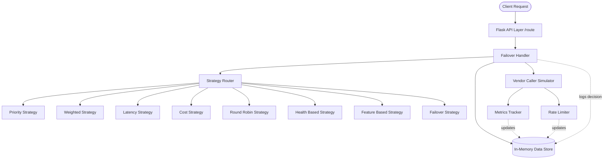

# Architecture & Routing Decisions

## System Architecture

The Intelligent Vendor Routing Platform is built with a modular, service-oriented architecture inside a single Flask application.

### Core Components:

1. **Data Store (`store/data_store.py`)**: A thread-safe, in-memory storage singleton that holds all state: vendors, metrics, routing rules, rate limits, and logs. It uses `threading.Lock()` to prevent race conditions during concurrent API requests.
2. **Failover Handler (`services/failover_handler.py`)**: The brain of the operation. It orchestrates getting the rules, filtering out bad vendors, picking the right strategy, attempting the call, and managing the failover loop if a vendor fails.
3. **Strategy Router (`strategies/`)**: Implements the Factory pattern. Based on the configuration, it delegates the actual selection logic to one of 5 independent strategy modules.
4. **Vendor Caller (`services/vendor_caller.py`)**: Since we don't have real external vendors, this module simulates network calls. It injects realistic artificial latency (50ms - 800ms) and random failures (15% chance) so the metrics and failover systems actually have real data to work with.
5. **Services Layer**: `metrics_tracker.py` calculates success rates and determines health. `rate_limiter.py` enforces a 60-second sliding window limit per vendor.

## How Routing Decisions Are Made

When a request comes into `POST /route` for a specific capability (e.g., `PAN_VERIFICATION`), the system follows a strict decision tree:

### 1. Capability Matching
It fetches all vendors registered for `PAN_VERIFICATION`. If none exist, it fails fast.

### 2. Pre-Filtering (The Elimination Phase)
Before applying any strategy, it filters the list of available vendors based on strict requirements. A vendor is skipped (and the reason is logged) if:
- **It is Unhealthy**: Its error rate > 50% or it has 5+ consecutive failures.
- **It is Rate Limited**: It has exceeded its `rateLimitPerMinute` quota.
- **Missing Features**: The client requested specific features (e.g., `["photo_match"]`) and the vendor doesn't support them.
- **Latency Threshold**: The routing config specified a max latency, and the vendor's average latency exceeds it.

### 3. Strategy Selection (The Picking Phase)
The remaining vendors are passed to the configured routing strategy. We support 8 strategies:

1. **Priority**: Sorts vendors by priority number. Picks the lowest number (e.g., Priority 1 > Priority 2).
2. **Weighted**: Uses cumulative probabilities. If Vendor A has weight 70 and Vendor B has 30, it generates a random number to ensure A gets ~70% of traffic.
3. **Lowest Latency**: Checks the metrics tracker. Picks the vendor with the lowest `avg_latency_ms`. (New vendors get a free pass of 0ms to build stats).
4. **Lowest Cost**: Simple sort by `costPerRequest`.
5. **Round Robin**: Uses a counter in the data store to cycle through available vendors sequentially.
6. **Health-Based**: Picks the vendor with the highest historical success rate.
7. **Feature-Based**: Picks the vendor supporting the highest absolute number of features.
8. **Failover**: Explicitly relies on the strict priority chain to act solely as a cascading fallback sequence.

### 4. Execution & Failover
The selected vendor is called. 
- If it **succeeds**, metrics are updated, and the response is returned to the client.
- If it **fails** (timeout, 500 error, etc.), the failure is logged, the vendor's error rate goes up, and the system loops back to Step 3, picking the *next* best vendor from the remaining list.

This guarantees that as long as one capable, healthy vendor exists, the client will get a successful response, totally unaware of the chaos happening behind the scenes.
